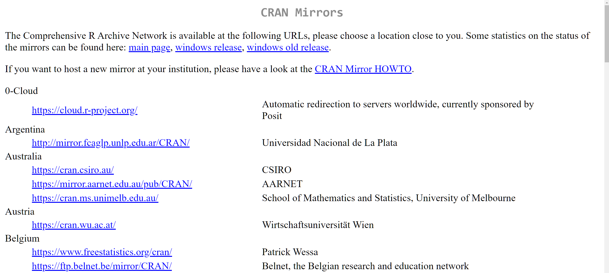
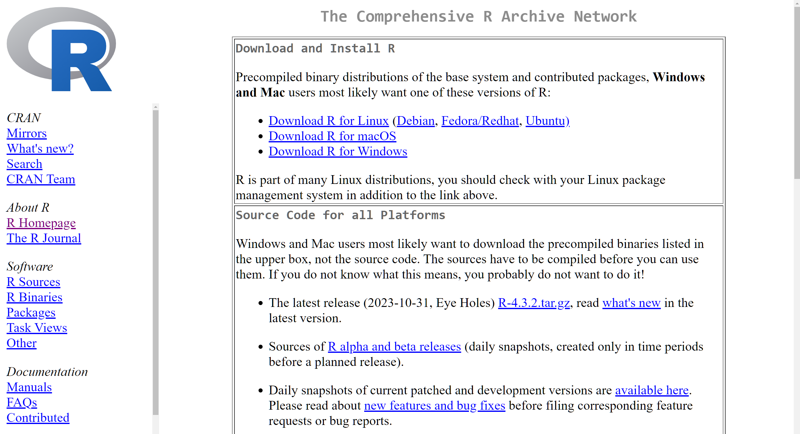
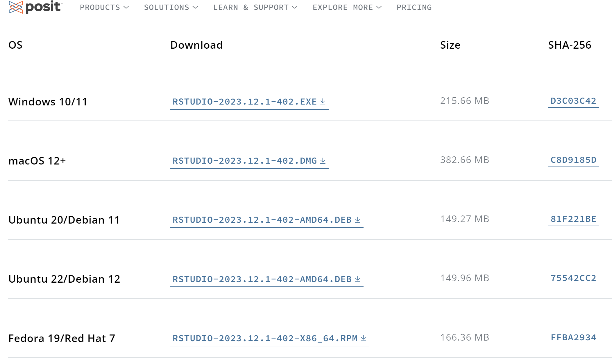
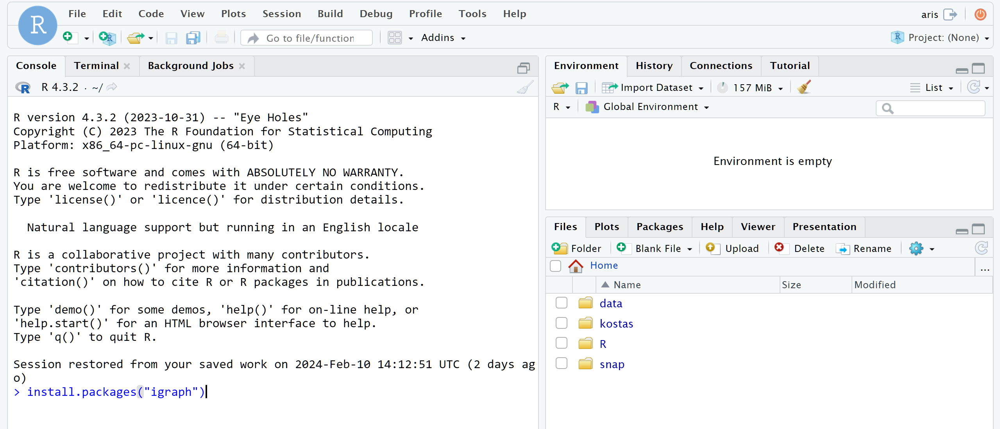
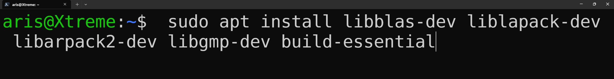

```{r setup, include=FALSE}
knitr::opts_chunk$set(dpi=600,fig.width=6)
```

### 1. Εγκατάσταση της γλώσσας R
Η R είναι μια γλώσσα προγραμματισμού υψηλού επιπέδου. Είναι επίσης περιβάλλον στατιστικής ανάλυσης και οπτικοποίησης δεδομένων. Πρόκειται για ένα έργο ελεύθερου λογισμικού, παρόμοιο με τη γλώσσα προγραμματισμού S η οποία αναπτύχθηκε στα Bell Laboratories.

Η R παρέχει μια μεγάλη γκάμα από στατιστικές τεχνικές (γραμμικά και μη γραμμικά μοντέλα, κλασικά στατιστικά τεστ, ανάλυση χρονοσειρών, κατηγοριοποίηση και συσταδοποίηση μεταξύ άλλων). Έχει δυνατότητα να ενσωματώνει βιβλιοθήκες/πακέτα τρίτων που αφορούν διάφορους τομείς έρευνας και ανάλυσης δεδομένων.

Η εγκατάσταση της R γίνεται εύκολα μέσω της ιστοσελίδας [εδώ](https://www.r-project.org/).

<center>


</center>

<center>




</center>


<center>




</center>

### 1.2 Εγκατάσταση RStudio

Το RStudio είναι ένα ολοκληρωμένο περιβάλλον ανάπτυξης εφαρμογών σε γλώσσα R (IDE).  Η εγκατάσταση του γίνεται πολύ εύκολα μέσω της σελίδας [εδώ](https://posit.co/download/rstudio-desktop/). Θα πρέπει να κατεβάσετε τον installer που αντιστοιχεί στο λειτουργικό σύστημα του υπολογιστή σας.

<center>





</center>


### 1.3 Εγκατάσταση του πακέτου igraph

Το igraph είναι μια βιβλιοθήκη/πακέτο ελεύθερου λογισμικού ειδικά σχεδιασμένη για τη δημιουργία και επεξεργασία γράφων καθώς επίσης και για την ανάλυση περίπλοκων δικτύων. 

Η εγκατάσταση της βιβλιοθήκης igraph είναι δυνατή μέσω της διεπαφής εντολών του R Studio. Επιπλέον, στην περίπτωση όπου η εγκατάσταση της R έχει πραγματοποιηθεί σε ένα λειτουργικό σύστημα χωρίς την παρουσία του R Studio, η βιβλιοθήκη μπορεί εξίσου να εγκατασταθεί απευθείας μέσω της γραμμής εντολών της R.	 Και στις δύο περιπτώσεις η εγκατάσταση του πακέτου είναι εφικτή μέσω της εντολής **install.packages("igraph")**. 

<center>




</center>


Στην περίπτωση που το λειτουργικό σύστημα του υπολογιστή είναι linux υπάρχει πιθανότητα να εμφανιστεί το παρακάτω σφάλμα κατά την εγκατάσταση του igraph: **installation of package ‘igraph’ had non-zero exit status**.

Για να γίνει η εγκατάσταση σωστά θα πρέπει πρώτα να γίνει εγκατάσταση των linux βιβλιοθηκών: **libblas-dev**, **liblapack-dev**, **libarpack2-dev**, **libgmp-dev** και **build-essential**.


<center>





</center>

### 2. Εισαγωγή στον προγραμματισμό με γλώσσα R

### 2.1 Ανάθεση τιμών σε μεταβλητές και συγκριτικοί τελεστές
Στην R η ανάθεση τιμών σε μεταβλητές μπορεί να γίνει είτε με τον χαρακτήρα **‘=’** ή με τον χαρακτήρα **‘<-’**. Επίσης σε περίπτωση που δεν θέλουμε κάποια μεταβλητή να είναι αποθηκευμένη στο workspace του RStudio, μπορούμε να την διαγράψουμε μέσω της εντολής **rm(όνομα_μεταβλητής)**. Μπορούμε να τυπώσουμε την τιμή μιας μεταβλητής απλά γράφοντας το όνομα μετά από την ανάθεσή της. Με την εντολή class **(όνομα_μεταβλητής)** έχουμε την δυνατότητα να ελέγξουμε τι τύπου είναι μια μεταβλητή (αριθμός, λογική μεταβλητή, κλπ).

```{r}
var1 <- 2 # Ανάθεση τιμής σε μεταβλητή με <-
var1
```

```{r}
var2 = 5.6 # Ανάθεση τιμής σε μεταβλητή με =
var2 * 3
```
```{r}
class(var2)
```
Όπως και σε άλλες γλώσσες προγραμματισμού έτσι και στην R είναι εφικτή η σύγκριση μεταξύ τιμών μεταβλητών με χρήση των γνωστών τελεστών (<, >, <=, >=,  ==, !=). Το αποτέλεσμα των συγκρίσεων δίνεται με τη μορφή λογικής μεταβλητής.

```{r}
var1 <- 5
var2 <- 8
```

```{r}
var1 == var2
```

```{r}
var1 != var2
```

```{r}
var1 < var2
```

### 2.2 Ειδικές τιμές μεταβλητών


Υπάρχουν συγκεκριμένες/σταθερές τιμές τις οποίες χρησιμοποιούμε για ειδικές περιπτώσεις. Η τιμή **NA** χρησιμοποιείται για να δηλώσουμε έλλειψη τιμής (ή άγνωστη τιμή). Η τιμή **NULL** χρησιμοποιείται για την περιγραφή «άδειων» αντικειμένων (π.χ: λίστας). Για να δηλώσουμε + ή – άπειρο χρησιμοποιούμε τις τιμές **Inf** και **-Inf** αντίστοιχα. Η τιμή **NaN** χρησιμοποιείται για αποτελέσματα τα οποία δεν μπορούμε να ορίσουμε με λογικό τρόπο.

### 2.3 Διανύσματα και λίστες
Μπορούμε εύκολα να δημιουργήσουμε διανύσματα μέσω της εντολής c(τιμές_διανύσματος). Οι τιμές του διανύσματος θα πρέπει να χωρίζονται μεταξύ τους με κόμματα. Υπάρχουν και εναλλακτικοί τρόποι να ορίσουμε διανύσματα.

```{r}
vector1 <- c(1, 3, 5, 7, 9)
vector2 <- c("This", "is", "a", "test")
vector3 <- c(FALSE, TRUE)
```

```{r}
# Συνδυασμός των τριών διανυσμάτων
super_vector <- c(vector1, vector2, vector3)
super_vector
```
Παρατηρούμε ότι όταν συνδυάσαμε τα 3 διανύσματα σε ένα ‘υπερδιάνυσμα’, όλες οι τιμές ανεξαρτήτως της προέλευσης τους μετατράπηκαν σε αλφαριθμητικά (strings). Αυτό συμβαίνει διότι ο υπολογιστής τα μετατρέπει αυτόματα στον τύπο που είναι πιο ευέλικτος ή μπορεί να αντιπροσωπεύει όλα τα στοιχεία του διανύσματος. Αυτό βοηθά στη διατήρηση των δεδομένων συνεπή σε αυτό το διάνυσμα.


```{r}
# Εναλλακτικός τρόπος ορισμού διανυσμάτων

vector1_alt <- 1:10

vector2_alt <- rep(1:4, each=4) # Κάθε στοιχείο επαναλαμβάνεται 4 φορές

vector3_alt <- seq(30, 40, 3) # Αλληλουχία αριθμών από 30 έως 40 με βήμα 3
```

Μπορούμε να κάνουμε πράξεις βάσει στοιχείων καθώς επίσης και μαθηματικές και λογικές πράξεις μεταξύ διανυσμάτων

```{r}
length(vector1_alt) # Μέγεθος διανύσματος

vector1_alt * 7 # Πολλαπλασιασμός διανύσματος με αριθμό

sum(vector1) # Άθροισμα στοιχείων διανύσματος

mean(vector1) # Μέσος όρος στοιχείων διανύσματος

vector1 == vector1_alt # Λογικό ίσον μεταξύ δύο διανυσμάτων

```


Μπορούμε από διανύσματα να επιλέξουμε συγκεκριμένα στοιχεία με λογικές πράξεις ή με διανυσματικούς τελεστές.

```{r}
vector1_alt[9] # Επιστρέφει το 9ο στοιχείο του διανύσματος

vector1_alt[3:7] # Επιστρέφει από το 3ο έως το 7ο στοιχείο του διανύσματος

vector1_alt[vector1_alt > 5] # Επιστρέφει μόνο στοιχεία > 5

vector1_alt[11:13] <- 11:13 # Πρόσθεση επιπλέον τιμών στο διάνυσμα
```


Οι λίστες είναι συλλογές αντικειμένων. Μπορούν να περιέχουν στοιχεία πάσης φύσεως (αλφαριθμητικά, διανύσματα, άλλες λίστες, κλπ). Μπορούμε να ονομάσουμε τα στοιχεία μιας λίστας για μεγαλύτερη ευκολία.

```{r}
lst1 <- list(puf=vector1, bam=vector2, boom=vector3, frw="Fireworks!")

lst_emt <- list() # Μια άδεια λίστα

null_lst <- NULL # Δημιουργία null λίστας

lst1["puf"] # Έχουμε πρόσβαση στο στοιχείο που ονομάσαμε

lst1[[2]] # Εναλλακτικός τρόπος να έχουμε πρόσβαση στα στοιχεία της λίστας

lst1$boom # Ακόμη ένας τρόπος να έχουμε πρόσβαση σε συγκεκριμένα στοιχεία

lst_emt[[1]] <- 511 # Τοποθετούμε στοιχείο στην "άδεια" λίστα

null_lst <- c(7, 62) # Αντικατάσταση NULL με διάνυσμα
```

### 2.4 Παράγοντες

Πρόκειται για έναν ειδικό τύπο μεταβλητής ο οποίος χρησιμοποιείται έτσι ώστε να αποθηκεύσουμε κατηγορικά δεδομένα.

```{r}
# Διάνυσμα
hair_col_vec <- c("black", "brown", "red")

# Αναπαράσταση ως διάνυσμα με τιμές "παράγοντα"
hair_col_fac <- factor(c("black", "brown", "red"))

levels(hair_col_fac)

```
```{r}
as.numeric(hair_col_fac)
```

### 2.5 Πίνακες
Στην R έχουμε δύο μορφές πινάκων: τους διδιάστατους πίνακες (tables) και τους πολυδιάστατους πίνακες (arrays). Και στις δύο περιπτώσεις πρόκειται για μια εναλλακτική μορφή διανυσμάτων.


```{r}
matrix1 <- rep(2, 30) # Διάνυσμα με 30 φορές την τιμή 2

dim(matrix1) <- c(5, 6) # Δημιουργούμε πίνακα 5x6 από το διάνυσμα

matrix1_alt <- matrix(2, 5, 6) # Εναλλακτικός τρόπος δημιουργίας του πίνακα

matrix1_alt
```

Μπορούμε να δημιουργήσουμε έναν πίνακα με βάση τις γραμμές ή τις στήλες από τις οποίες θα αποτελείται. Επίσης όπως και με τα διανύσματα έτσι και με τους πίνακες μπορούμε να διαλέξουμε ένα υποσύνολο των στοιχείων τους για περαιτέρω ανάλυση.

```{r}
# Δημιουργία πίνακα 7x3 (με βάση τις στήλες)
matrix2 <- cbind(1:7, 7:1, 7:13)

# Δημιουργία πίνακα 3x7
matrix3 <- rbind(1:7, 7:1, 7:13)

# Επιλέγουμε την πρώτη στήλη του πίνακα ως διάνυσμα
matrix2[, 1]

```

```{r}
# Αναστροφή πίνακα
t(matrix1)

```

```{r}
# Δημιουργία τριδιάστατου πίνακα διαστάσεων 5x5x2
arr1 <- array(data=1:25, dim=c(5, 5, 2)) 
arr1
```

### 2.5 Data frames

Πρόκειται για μια εξειδικευμένη μορφή πίνακα την οποία χρησιμοποιούμε έτσι ώστε να αναπαραστήσουμε σύνολα δεδομένων με οργανωμένο και εύκολα κατανοητό τρόπο. Οι γραμμές αντιπροσωπεύουν δείγματα δεδομένων ενώ οι στήλες αντιπροσωπεύουν χαρακτηριστικα/μεταβλητές.

```{r}
# Παράδειγμα data frame
car_df <- data.frame(ID=1:3,
                     Manufacturer=c("Toyota", "Subaru", "Mercedes"),
                     Black=c(FALSE, FALSE, TRUE),
                     DM=c(2012, 2013, 2024))

car_df$Manufacturer
```

```{r}
# Μπορούμε να μετατρέψουμε τα αλφαριθμητικά σε παράγοντες
df2 <- data.frame(nam=c("Nikos", "Giannis", "Maria"), stringsAsFactors = TRUE)

df2$nam
```

```{r}
# Επίσης μπορούμε να επιλέξουμε συγκεκριμένες στήλες και γραμμές από ένα data frame

car_df[2,]

```
```{r}
# Παίρνουμε το δεύτερο χαρακτηριστικό για όλα τα αμάξια που κατασκεβάστηκαν μετά το 2012
car_df[car_df$DM > 2012, 2]
```

```{r}
### Μπορούμε να κάνουμε και στατιστική ανάλυση στις τιμές ενός data frame
mean(car_df[car_df$Black==FALSE, 4])

```

### 2.6 Ροές ελέγχου και βρόχοι επανάληψης

Οι ροές ελέγχου και οι βρόχοι επανάληψης στη γλώσσα R είναι παρόμοιοι με άλλες γλώσσες προγραμματισμού. Τα κομμάτια κώδικα στην R που αφορούν σε βρόχους βρίσκονται μέσα σε **{}**.

```{r}
# Μια απλή ροή ελέγχου
var1 <- 10
var2 <- 20

if (var2 == 44) var1 <- var1 + 2 else var1 <- var1 / 2

var1
```

```{r}
# Απλός βρόχος επανάληψης με for
athroisma <- 0
for(i in 1:var1){
  athroisma <- athroisma + i
}

athroisma
```
```{r}
# Απλός βρόχος επανάληψης με while

while (var1 > 0){
  print(var1)
  var1 <- var1 - 1
}

```

### 2.7 Οπτικοποίηση δεδομένων

Η R προσφέρει μια μεγάλη γκάμα διαφορετικών τύπων γραφημάτων τα οποία μπορούμε να χρησιμοποιήσουμε έτσι ώστε να οπτικοποιήσουμε και να ερμηνεύσουμε προς ανάλυση δεδομένα.


```{r}
# Διάβασμα toy example δεδομένων σε πίνακα
data <- as.matrix(mtcars)

# Δημιουργία heatmap των κανονικοποιημένων δεδομένων
heatmap(data, scale = "column")
```


```{r}

# Δημιουργία connected scatter plot
a <- c(1:6)
b <- c(5, 4, 2, 4, 3, 5)
c <- c(3, 1, 2, 5, 4, 2)

{plot(b ~ a, type = "b", bty = "l", xlab = "value of a", ylab = "value of b",
     col = rgb(0.1, 0.5, 0.5, 0.7),
     lwd = 3, pch = 19,
     ylim = c(1, 5))
lines(c ~ a, col = rgb(0.5, 0.2, 0.5, 0.7),
      lwd = 3, pch = 15,
      type = "b")

legend("bottomright",
       legend = c("Group 1", "Group 2"),
       col = c(rgb(0.1, 0.5, 0.5, 0.7), rgb(0.5, 0.2, 0.5, 0.7)),
       pch = c(19, 15),
       bty = "n",
       pt.cex = 2,
       cex = 1.2,
       text.col = "black",
       horiz = FALSE,
       inset = c(0.05, 0.05))}

```

### 3. Ανάλυση δικτύων με igraph στη γλώσσα R

### 3.1 Δημιουργία δικτύων


Το αρχικό στάδιο της δημιουργίας και ανάλυσης δικτύων με τη χρήση του πακέτου igraph περιλαμβάνει την ενσωμάτωση της εν λόγω βιβλιοθήκης στο τρέχον περιβάλλον του RStudio. Η ενσωμάτωση αυτή επιτυγχάνεται μέσω της εκτέλεσης της εντολής: library(igraph). Μετά την επιτυχή φόρτωση της βιβλιοθήκης igraph, τίθενται οι βάσεις για την κατασκευή του πρώτου μας απλού δικτύου.


```{r}
library(igraph)

# Δημιουργία απλού μη κατευθυνόμενου δικτύου με 4 κόμβους
net1 <- graph(edges = c(1,3, 2,4, 3,4, 1,2), n=4, directed = F)
plot(net1)

```

```{r}
# Δημιουργία απλού κατευθυνόμενου δικτύου με 4 κόμβους
net2 <- graph(edges = c(1,3, 2,4, 3,4, 1,2), n=4, directed = T)
plot(net2)
```

```{r}
net2
```

Παράδειγμα κατευθυνόμενου γράφου με 4 κόμβους και 4 ακμές. Η σειρά αριθμών πριν από το D είναι ένα μοναδικό αναγνωριστικό που αποδίδεται στον γράφο που έχει δημιουργηθεί. Το D υποδεικνύει ότι έχουμε να κάνουμε με έναν κατευθυνόμενο γράφο. Οι 3 παύλες υποδεικνύουν ότι ο γράφος δεν έχει συγκεκριμένα χαρακτηριστικά (όσον αφορά το όνομα, τα βάρη ή τον τύπο κόμβου- διμερής). Η σειρά ακμών υποδεικνύει τις ακμές/αλληλεπιδράσεις μεταξύ των κόμβων του γράφου (πώς συνδέονται οι κόμβοι μεταξύ τους).


```{r}
# Δημιουργία απλού κατευθυνόμενου δικτύου όπου οι κόμβοι έχουν ονόματα
# Σε αυτή την περίπτωση δεν χρειάζεται να ορίσουμε τον αριθμό των κόμβων

named_graph <- graph(c("Kostas", "Maria", "Maria", "Kostas", "Aris", 
                       "Maria", "Aris", "Giorgos", "Aris"))
plot(named_graph)
```

Κατά τη δημιουργία γράφων με ονομαστικούς κόμβους μπορούμε επίσης να καθορίσουμε ποιοι κόμβοι είναι απομονωμένοι στο δίκτυο (κόμβοι που δεν συνδέονται με ακμές με οποιονδήποτε άλλο κόμβο).


```{r}
named_graph2 <- graph(c("Kostas", "Maria", "Maria", "Kostas", "Aris", 
                       "Maria", "Aris", "Giorgos", "Aris"),
                      isolates=c("Antonis", "Giannis", "Marios"))
plot(named_graph2)

```

Γράφοι μπορούν επίσης να δημιουργηθούν με τη χρήση της εντολής **graph_from_literal(node_ _list)**. Αν και αυτός είναι ένας γρήγορος τρόπος για τη δημιουργία μικρών, απλών δικτύων, δεν συνιστάται όταν πρέπει να μοντελοποιηθούν μεγάλοι πολύπλοκοι γράφοι με πολλαπλές σχέσεις.

```{r}

simple_graph <- graph_from_literal(n1--n2, n3---n4, n4--n1)
plot(simple_graph)

```

### 3.2 Χαρακτηριστικά κόμβων ακμών και δικτύων

Υπάρχουν ορισμένες εντολές που μπορούμε να χρησιμοποιήσουμε για να αποκτήσουμε πρόσβαση σε πληροφορίες σχετικά με ορισμένα στοιχεία των γράφων που δημιουργούμε. Για παράδειγμα, η εντολή E(graph) μπορεί να χρησιμοποιηθεί για την πρόσβαση σε πληροφορίες σχετικά με τις ακμές ενός γράφου, ενώ η εντολή V(graph) χρησιμοποιείται για την πρόσβαση σε πληροφορίες σχετικά με τους κόμβους του. Το graph[] όπου graph είναι το όνομα του γράφου μπορεί επίσης να χρησιμοποιηθεί για την πρόσβαση στον πίνακα γειτνίασης ενός γράφου. Ο πίνακας γειτνίασης είναι ένας πίνακας που αναπαριστά τον τρόπο με τον οποίο οι κόμβοι του γράφου συνδέονται μεταξύ τους. Για απλούς γράφους χωρίς βάρη, ο πίνακας λαμβάνει 2 τιμές: 0 και 1 με το 0 να υποδηλώνει την έλλειψη σύνδεσης μεταξύ 2 κόμβων και το 1 να αντιπροσωπεύει το αντίθετο.

```{r}
named_graph3 <- graph(c("Kostas", "Maria", "Maria", "Kostas", "Aris", 
                       "Maria", "Aris", "Giorgos", "Aris"))

E(named_graph3) # Πληροφορίες για τις ακμές του γράφου
V(named_graph3) # Πληροφορίες για τους κόμβους του γράφου

named_graph3[] # Πίνακας γειτνίασης γράφου

```

Μπορούμε να ορίσουμε συγκεκριμένα χαρακτηριστικά στους κόμβους και τις ακμές ενός γράφου καθώς και στον ίδιο το γράφο. Μπορούμε επίσης να αποκτήσουμε πρόσβαση σε αυτά τα χαρακτηριστικά, να τα τροποποιήσουμε ή ακόμα και να τα αφαιρέσουμε. Θα πρέπει επίσης να σημειωθεί ότι μπορούμε να χρησιμοποιήσουμε συγκεκριμένα χαρακτηριστικά που μας ενδιαφέρουν προκειμένου να τροποποιήσουμε τον τρόπο με τον οποίο φαίνεται ο γράφος μας.

```{r}
# Χαρακτηριστικό για τους κόμβους του γράφου
V(named_graph3)$sex <- c("Male", "Female", "Male", "Male")
# Χαρακτηριστικό για τις ακμές του γράφου
E(named_graph3)$weight <- 12 # Όλες οι ακμές έχουν βάρος 12

# Χαρακτηριστικό για όλο τον γράφο
named_graph3 <- set_graph_attr(named_graph3, "onoma", "Friends")

# Ορισμός χρωμάτων με βάση χαρακτηριστικό των κόμβων του γράφου
vertex_colors <- ifelse(V(named_graph3)$sex == "Male", "skyblue", "pink")

# Οπτικοποίηση του γράφου με χρώματα
plot(named_graph3, edge.arrow.size=.5, vertex.label.color="black",
     vertex.label.dist=1.5, vertex.color=vertex_colors)
```

Σε ορισμένες περιπτώσεις, τα γραφήματα μπορεί να είναι πολύπλοκα χωρίς προφανή λόγο. Για παράδειγμα, στο παράδειγμα που φαίνεται στην παραπάνω εικόνα, υπάρχουν περιττές ακμές μεταξύ των κόμβων "Μαρία" και "Κώστας". Σε ορισμένες περιπτώσεις, τα self loops είναι επίσης χαρακτηριστικά που πρέπει να εξαλειφθούν από το γράφημα. Μπορούμε να απλοποιήσουμε το γράφημά μας χρησιμοποιώντας την εντολή **simplify()**. Το αποτέλεσμα της απλοποίησης μπορεί να φανεί στο δεξί γράφημα.

```{r}
named_graph4 <- graph(c("Kostas", "Maria", "Maria", "Kostas", "Maria","Kostas", "Aris", "Maria", "Aris", "Giorgos", "Aris", "Kostas",
                       "Kostas", "Aris", "Giorgos", "Giorgos"))


plot(named_graph4)
```

```{r}
named_graph4_simple <- simplify(named_graph4, remove.multiple = T, 
                                remove.loops = T)


plot(named_graph4_simple)
```

### 3.2 Ειδικοί τύποι γράφων

Το Igraph παρέχει εντολές μέσω των οποίων μπορούμε να δημιουργήσουμε γραφήματα που αντιστοιχούν σε συγκεκριμένους τύπους και μοντέλα. Για παράδειγμα, χρησιμοποιώντας την εντολή **make_empty_graph()** μπορούμε να δημιουργήσουμε έναν κενό γράφο (που περιέχει κόμβους αλλά καθόλου ακμές). Με τη χρήση της εντολής **make_full_graph()** μπορούμε να δημιουργήσουμε έναν πλήρως συνδεδεμένο γράφο (όπου όλοι οι κόμβοι είναι συνδεδεμένοι μεταξύ τους).

Μπορούμε ακόμη να δημιουργήσουμε γράφους που αντιστοιχούν σε συγκεκριμένα μοντέλα/μελέτες. Για παράδειγμα, χρησιμοποιώντας την εντολή **make_graph()** και δίνοντας το όνομα "Zachary" μπορούμε να δημιουργήσουμε ένα γράφημα που αντιστοιχεί στο κοινωνικό δίκτυο της λέσχης καράτε του Zachary: πρόκειται για ένα γράφημα που αναπαριστά τις φιλικές σχέσεις μεταξύ 34 μελών μιας λέσχης καράτε ενός πανεπιστημίου των ΗΠΑ τη δεκαετία του 1970.


| Συνάρτηση              | Δίκτυο                                                                                        |
|------------------------|-----------------------------------------------------------------------------------------------|
| `make_empty_graph`     | Κενός γράφος (δεν έχει καμία ακμή)                                                            |
| `make_full_graph`      | Πλήρως συνδεδεμένος γράφος graph (όλοι οι κόμβοι συνδέονται)                                  |
| `make_star`            | Γράφος δομής αστέρα (όλοι οι κόμβοι συνδέονται με έναν κεντρικό)                              |
| `make_tree`            | Γράφος δομής δένδρου(σχεδόν όλοι οι κόμβοι εκτός από τα φύλλα έχουν τον ίδιο αριθμό παιδιών)  |
| `make_ring`            | Γράφος δομής δακτυλίου                                                                        |
| `sample_gnm`           | Τυχαίος γράφος με βάση το μοντέλο G(n,m) των Erdos-Renyi                                      |
| `sample_smallworld`    | Γράφος με βάση το μοντέλο μικρόκοσμου των Watts-Strogatz                                      |
| `sample_pa`            | Γράφος προτιμησιακής προσκόλλησης με βάση το μοντέλο Barabási-Abert ή το μοντέλο Price        |

<br>


```{r}
emt_graph <- make_empty_graph(20)

plot(emt_graph)
```


```{r}
full_graph <- make_full_graph(20)

plot(full_graph)
```

```{r}
# Δημιουργία γράφου τύπου δένδρου, κάθε κόμβος θα έχει 2 "παιδιά"
tree_graph <- make_tree(20, children=2, mode="undirected")

plot(tree_graph)

```

```{r}
star_graph <- make_star(20)

plot(star_graph)
```


```{r}
# Δημιουργία γράφου τύπου small world

# Δημιουργεί ένα πλέγμα (με dim διαστάσεις) και επανασυνδέει τις ακμές τυχαία με πιθανότητα p. Η γειτονιά στην οποία συνδέονται τα άκρα είναι nei. 

small_world <- sample_smallworld(dim=2, size=10, nei=1, p=0.1)

plot(small_world, vertex.size=10, vertex.label=NA, layout=layout_in_circle)

```


```{r}
# Μοντέλο Barabasi-Albert για scale-free γράφους (n είναι ο αριθμός των κόμβων, power είναι η ισχύς της προσκόλλησης (1 είναι γραμμική): m είναι ο αριθμός των ακμών που προστίθενται σε κάθε χρονικό βήμα)

bar_albert <- sample_pa(n=150, power=1, m=1, directed=F)


plot(bar_albert, vertex.size=6, vertex.label=NA)

```


```{r}
zachary_karate <- graph("Zachary") # Η λέσχη καράτε του Zachary

plot(zachary_karate, vertex.size=10, vertex.label=NA)
```

Μπορούμε επίσης να επανασυνδέσουμε τις ακμές του γράφου σύμφωνα με συγκεκριμένες ιδιότητες. Για παράδειγμα, χρησιμοποιώντας την εντολή rewire() μπορούμε να αλλάξουμε τα τελικά σημεία ενός γράφου ομοιόμορφα τυχαία με πιθανότητα prob. Μπορούμε επίσης να επανασυνδέσουμε έναν γράφο έτσι ώστε οι κορυφές να συνδέονται με άλλες κορυφές σε ορισμένη απόσταση.

```{r}
# each_edge() είναι μια μέθοδος επανασύνδεσης που αλλάζει ομοιόμορφα τυχαία τα τελικά σημεία των ακμών με πιθανότητα prob.

ring_graph <- make_ring(20)

rewired_ring <- rewire(ring_graph, each_edge(prob=0.4))

plot(ring_graph)
```

```{r}
plot(rewired_ring)
```

```{r}
ring_neigh = connect.neighborhood(ring_graph, 8)

plot(ring_neigh, vertex.size=8, vertex.label=NA)

```


### 3.3 Ανάλυση γράφων από αρχεία

Υπάρχουν πολυάριθμες μέθοδοι για την εισαγωγή δεδομένων δικτύων ή γράφων από εξωτερικά αρχεία, με μια κοινή μορφή να είναι η λίστα ακμών (edge list). Μια λίστα ακμών αναπαριστά δεδομένα ενός δικτύου περιγράφοντας τις συνδέσεις μεταξύ ζευγών κόμβων ή κορυφών, όπου κάθε γραμμή αποτελείται συνήθως από δύο αναγνωριστικά κόμβων που υποδεικνύουν μια άμεση σύνδεση ή σχέση μεταξύ τους. Αυτή η μορφή αποθήκευσης είναι ζωτικής σημασίας για την ανάλυση γράφων, διότι παρέχει έναν απλό και διαισθητικό τρόπο περιγραφής της δομής ενός δικτύου, επιτρέποντας την αποτελεσματική κατασκευή και χειρισμό γράφων σε υπολογιστικά περιβάλλοντα. Η απλότητα της μορφής της λίστας ακμών διευκολύνει τη χρήση της σε διάφορα λογισμικά και εργαλεία για την ανάλυση δικτύων, καθιστώντας την απαραίτητο εφόδιο για τους ερευνητές και τους επαγγελματίες που εργάζονται με δεδομένα που βασίζονται σε γράφους.

Οι λίστες ακμών συνήθως αποθηκεύονται ως αρχεία .csv (τιμές διαχωρισμένες με κόμμα) ή .txt (κείμενο), με δύο στήλες που απαριθμούν τα ζεύγη κόμβων ή στοιχείων που συνδέονται μεταξύ τους στο γράφημα. Για την ενσωμάτωση αυτών των λιστών ακμών στο R, μπορεί να χρησιμοποιηθεί η συνάρτηση read.table για την εισαγωγή των δεδομένων, τα οποία στη συνέχεια μετατρέπονται σε πίνακες για περαιτέρω επεξεργασία. Στη συνέχεια, χρησιμοποιείται η συνάρτηση graph_from_edgelist() για τη δημιουργία του γράφου με βάση τον κατάλογο ακμών που προκύπτει από τον πίνακα. Η προσέγγιση αυτή διευκολύνει την απρόσκοπτη μετατροπή των αναπαραστάσεων ακμών σε μορφή πίνακα σε δομημένα μοντέλα γράφων, επιτρέποντας την ολοκληρωμένη ανάλυση δικτύων στο περιβάλλον προγραμματισμού R.

Το ακόλουθο παράδειγμα αφορά στη δημιουργία ενός δικτύου igraph μέσω μιας λίστας edgelist που είναι αποθηκευμένη σε ένα αρχείο κειμένου. Η λίστα ακμών αντιπροσωπεύει ένα δίκτυο αλληλεπίδρασης πρωτεϊνών-πρωτεϊνών με 40 πρωτεΐνες και 36 αλληλεπιδράσεις. Το δίκτυο ppi μπορεί να μεταφορτωθεί από το σύνδεσμο [εδώ](https://mega.nz/file/TMIjDLYS#OjdEN4nxLqGsWKCYKyi63x7IcmhaB_RcQZPjIS0Q3AY).


```{r}
data <- read.table("ppi.txt", header=FALSE)

data <- as.matrix(data)

network <- graph_from_edgelist(data, directed = FALSE)

plot(network, vertex.label=NA)
```

Μια εναλλακτική διαδεδομένη μέθοδος για την αναπαράσταση δεδομένων δικτύων είναι οι πίνακες γειτνίασης (adjacency matrix). Ο πίνακας γειτνίασης είναι ένας τετραγωνικός πίνακας που χρησιμοποιείται για την απεικόνιση των σχέσεων μεταξύ των κόμβων σε ένα δίκτυο, όπου κάθε στοιχείο aij υποδηλώνει την παρουσία ή την απουσία σύνδεσης από τον κόμβο ii στον κόμβο jj. Αξίζει να σημειωθεί ότι η κύρια διαγώνιος ενός πίνακα γειτνίασης, η οποία αντιστοιχεί στα self loops, μπορεί να περιέχει παύλες, μηδενικά ή τιμές NaN (Not a Number), που υποδηλώνουν την απουσία βρόχων όπου ένας κόμβος συνδέεται με τον εαυτό του. Αυτοί οι πίνακες μπορούν να αποθηκευτούν σε αρχεία κειμένου ή CSV (Comma-Separated Values), προσφέροντας έναν δομημένο και συμπαγή τρόπο αποτύπωσης των πολύπλοκων διασυνδέσεων ενός δικτύου.

Για την εισαγωγή ενός συνόλου δεδομένων διαμορφωμένου ως πίνακα γειτνίασης στην R, μπορεί να χρησιμοποιηθεί και πάλι η συνάρτηση read.table() για την αρχική αποθήκευση του συνόλου δεδομένων σε μια δομή πίνακα. Στη συνέχεια, χρησιμοποιείται η εντολή as.matrix για τη μετατροπή των δεδομένων σε μορφή πίνακα, τηρώντας τις απαιτήσεις των αναπαραστάσεων πινάκων γειτνίασης. Στη συνέχεια, τυχόν παύλες ή μηδενικά που υπάρχουν κατά μήκος της κύριας διαγωνίου του πίνακα -ενδεικτικά της απουσίας αυτοσυνδέσεων- αντικαθίστανται με τιμές NaN (Not a Number), ώστε να αντικατοπτρίζεται με ακρίβεια η έλλειψη self loops στο δίκτυο. Στο τελικό βήμα, η συνάρτηση graph_from_adjacency_matrix () από το πακέτο igraph εφαρμόζεται στον προετοιμασμένο πίνακα γειτνίασης, διευκολύνοντας την κατασκευή ενός δικτύου igraph.

Το ακόλουθο παράδειγμα αφορά τη δημιουργία ενός δικτύου igraph μέσω ενός πίνακα γειτνίασης που είναι αποθηκευμένος σε ένα αρχείο κειμένου.  Ο πίνακας γειτνίασης αναπαριστά ένα δίκτυο 5 γονιδίων και 9 αλληλεπιδράσεων. Το δίκτυο GRN μπορεί να μεταφορτωθεί από το σύνδεσμο [εδώ](https://mega.nz/file/XBwyjAiR#HtDhsgMgS6Z6vCBmkl0IJBtxdMkzclR1ahzrvM34tnE).

```{r}
refGRN <- read.table("grn_actual.txt")

refGRN <- as.matrix(refGRN)

diag(refGRN) <- NA

# We specify not to take into account the elements of the main diagonal
refGRN_net <- graph_from_adjacency_matrix(refGRN, diag = FALSE)

plot(refGRN_net)
```

### 3.4 Εξατομίκευση οπτικοποίησης δικτύων με igraph

Όσον αφορά στην οπτικοποίηση δικτύων με το igraph, διατίθεται μια εκτεταμένη σειρά παραμέτρων. Αυτές οι παράμετροι κατηγοριοποιούνται σε επιλογές κόμβων (με πρόθεμα vertex.) και επιλογές ακμών (με πρόθεμα edge.). Παρακάτω, παρουσιάζεται μια επιμελημένη επιλογή αυτών των επιλογών για αναφορά. Ωστόσο, για μια ολοκληρωμένη επισκόπηση και περισσότερες λεπτομέρειες, συνιστάται να συμβουλευτείτε την τεκμηρίωση για την οπτικοποίηση του igraph, προσβάσιμη μέσω της διεύθυνσης igraph.plotting.

```{r}
# Ορίζουμε τις ακμές μεταξύ των κόμβων του γράφου
edges <- c(1,2, 1,3, 2,4, 3,4, 3,5, 5,6, 5,7, 7,8, 8,9, 9,10, 10,11, 11,12, 12,13, 13,14, 6,14, 4,9)

# Δημιουργία μη κατευθυνόμενου γράφου
example_graph <- graph(edges, directed = FALSE)

# Ορίζουμε μια κατηγορία για κάθε κόμβο του γράφου
V(example_graph)$category <- sample(c("medical", "political", "economics"), vcount(example_graph), replace = TRUE)

# Ορισμός μεγεθών για τους κόμβους του γράφου
V(example_graph)$size <- sample(10:30, vcount(example_graph), replace = TRUE)

# Ορισμός βαρών για ακμές του γράφου
E(example_graph)$weight <- sample(1:10, ecount(example_graph), replace = TRUE)

# Μπορούμε να οποτικοποιήσουμε τον γράφο με βάση τα χαρακτηριστικά των κόμβων και των ακμών του
plot(example_graph, vertex.size = V(example_graph)$size, vertex.label = " ",edge.label = "", edge.width = E(example_graph)$weight)
```

# Μπορούμε να προσαρμόσουμε τον τρόπο με τον οποίο οπτικοποιείται ο παραπάνω γράφος

```{r}
cols <- c("whitesmoke", "orangered", "gold")
V(example_graph)$color <- cols[V(example_graph)$category]

# Χαρτογράφηση με βάση τις μοναδικές κατηγορίες του γράφου
unique_categories <- unique(V(example_graph)$category)
category_colors <- setNames(cols, unique_categories)

V(example_graph)$color <- category_colors[V(example_graph)$category]


V(example_graph)$size2 <- V(example_graph)$size*1.1

E(example_graph)$width <- E(example_graph)$weight/2

E(example_graph)$edge.color <- "gray80"


# Δημιουργία πλαισίου Fruchterman-Reingold
layout_fr <- layout_with_fr(example_graph)

# Αλλάζουμε το μέγεθος του πλαισίου για να αυξήσουμε την απόσταση μεταξύ των κόμβων
scaling_factor <-50
layout_fr_scaled <- layout_fr * scaling_factor

{plot(example_graph, layout = layout_fr_scaled, vertex.color = V(example_graph)$color, vertex.label = " ", vertex.size = V(example_graph)$size2, edge.width = E(example_graph)$width, edge.color = E(example_graph)$edge.color)

# Μπορούμε να δημιουργήσουμε και ένα legend που θα αφορά στα χρώματα των κόμβων
legend(x=1.5, y=1.1, c("medical", "political", "economics"), pch=21,
col="#777777", pt.bg=cols, pt.cex=2, cex=.8, bty="n", ncol=1)}

```


```{r}

# Μπορούμε να παρακάμψουμε τα παραπάνω χρώματα ως εξής

plot(example_graph, edge.color="orangered", vertex.color="whitesmoke", vertex.label="")
```

Υπάρχουν και άλλοι τρόποι με τους οποίους μπορούμε να αναπαραστήσουμε ένα δίκτυο κόμβων. Για παράδειγμα, μπορούμε να πάρουμε τον πίνακα γειτνίασης του δικτύου και να δημιουργήσουμε ένα heatmap για να αναπαραστήσουμε τις πληροφορίες που παρέχει.

```{r}
netheat <- as_adjacency_matrix(example_graph, attr="weight", sparse=F)
colnames(netheat) <- V(example_graph)$name
rownames(netheat) <- V(example_graph)$name
palf <- colorRampPalette(c("magenta", "purple"))
heatmap(netheat[], Rowv = NA, Colv = NA, col = palf(100),
scale="none", margins=c(10,10) )
```

### 3.5 Περιγραφικές δικτύων και κόμβων

Πολυάριθμα περιγραφικά χαρακτηριστικά και μετρικές μπορούν να χρησιμοποιηθούν για να χαρακτηρίσουν τις ιδιότητες και τη δομή ενός γράφου. Αυτές οι περιγραφές περιλαμβάνουν ένα ευρύ φάσμα χαρακτηριστικών, όπως, μεταξύ άλλων, η κατανομή των κόμβων και των ακμών, τα μέτρα κεντρικότητας που προσδιορίζουν τους κόμβους με τη μεγαλύτερη επιρροή στο γράφημα, οι συντελεστές ομαδοποίησης που ποσοτικοποιούν το βαθμό στον οποίο οι κόμβοι συγκεντρώνονται μεταξύ τους και τα μήκη διαδρομών, όπως η μέση συντομότερη διαδρομή, η οποία παρέχει εικόνα της συνολικής συνδεσιμότητας του γράφου. Επιπλέον, περιγραφικοί δείκτες όπως η πυκνότητα προσφέρουν μια προοπτική για το πόσο στενά συνδεδεμένος είναι ο γράφος, υποδεικνύοντας την αναλογία των πραγματικών ακμών προς τον μέγιστο δυνατό αριθμό ακμών μεταξύ των κόμβων. Οι γράφοι μπορούν επίσης να αναλυθούν από την άποψη της αρθρωτότητάς τους, η οποία βοηθά στην κατανόηση της ισχύος της διαίρεσης σε ενότητες ή κοινότητες. Αυτές οι μετρικές διευκολύνουν συλλογικά την ολοκληρωμένη κατανόηση της τοπολογίας του γράφου, την αποτελεσματικότητα της μεταφοράς πληροφοριών ή πόρων και τον εντοπισμό των κομβικών στοιχείων εντός του δικτύου. Ας δημιουργήσουμε έναν απλό γράφο προκειμένου να ελέγξουμε τις διάφορες περιγραφικές ιδιότητες του igraph.

```{r}
# Δημιουργία απλού κατευθυνόμενου γράφου με βάση το μοντέλο Erdos-Renyi
dir_graph <- sample_gnm(12, 36, directed = TRUE)
plot(dir_graph, vertex.label="")
```

Τα ορίσματα της συνάρτησης **edge_density** περιγράφονται στον παρακάτω πίνακα,


| Όρισμα           | Περιγραφή                                      |
|------------------|------------------------------------------------|
| `graph`          | Ο γράφος εισόδου                               |
| `loops`          | Λογική σταθερά: επιτρέπει βρόχους στο γράφημα  |

<br>


```{r}
# Density; το ποσοστό των παρόντων ακμών από όλες τις πιθανές ακμές του δικτύου.
edge_density(dir_graph, loops=F)
```


```{r}
# Για ένα κατευθυνόμενο δίκτυο μπορούμε επίσης να υπολογίσουμε την πυκνότητα ως εξής
ecount(dir_graph)/(vcount(dir_graph)*(vcount(dir_graph)-1))
```


```{r}
# Αμοιβαιότητα: το ποσοστό των αμοιβαίων δεσμών (για ένα κατευθυνόμενο δίκτυο).
reciprocity(dir_graph)
```

```{r}
# Εναλλακτικός τρόπος υπολογισμού της αμοιβαιότητας- αμοιβαία, ασύμμετρα και nyll ζεύγη κόμβων
dyad_census(dir_graph) 
2*dyad_census(dir_graph)$mut/ecount(dir_graph)
```

Ορισμένα από τα ορίσματα της συνάρτησης  **transitivity** παρατίθενται στον παρακάτω πίνακα:


| Όρισμα           | Περιγραφή                                                                        |
|------------------|----------------------------------------------------------------------------------|
| `graph`          | Ο γράφος εισόδου                                                                 |
| `type`           | Ο τύπος της μεταβατικότητας προς υπολογισμό                                      |
| `vids`           | Τα αναγνωριστικά των κορυφών για τα οποία θα υπολογιστεί η τοπική μεταβατικότητα |
| `isolates`       | Καθορίζει τον τρόπο αντιμετώπισης κορυφών με βαθμό μηδέν ή ένα                   |

<br>


```{r}
# Transitivity;
# global - αναλογία τριγώνων (χωρίς να λαμβάνεται υπόψη η κατεύθυνση) προς συνδεδεμένα τρίγωνα.
# local - ο λόγος των τριγώνων προς τα συνδεδεμένα τρίγωνα στα οποία συμμετέχει κάθε κορυφή.

transitivity(dir_graph, type="global")
```

```{r}
# Ένας εναλλακτικός τρόπος για να γράψετε ακριβώς την παραπάνω εντολή
transitivity(as.undirected(dir_graph, mode="collapse"))
```

```{r}
transitivity(dir_graph, type="local")
```

```{r}
# Αυτό χρησιμοποιείται για κατευθυνόμενα δίκτυα
# Δείχνει για όλες τις πιθανές τριπλέτες κόμβων τον αριθμό των οποίων αντιστοιχεί σε κάθε μία από τις 16 πιθανές καταστάσεις
triad_census(dir_graph) 
```

Τα ορίσματα της συνάρτησης **diameter** καθώς και οι περιγραφές τους παρατίθενται στον παρακάτω πίνακα,


| Όρισμα           | Περιγραφή                                                       |
|------------------|-----------------------------------------------------------------|
| `graph`          | Ο γράφος εισόδου                                                |
| `directed`       | Λογική μεταβλητή: αν ο γράφος είναι κατευθυνόμενος ή όχι        |
| `unconnected`    | Λογική μεταβλητή: αν ο γράφος είναι μη συνδεδεμένος             |
| `weights`        | Προαιρετικό διάνυσμα για τον υπολογισμο βεβαρημένων αποστάσεων  |


<br>

```{r}
# Η διάμετρος ενός δικτύου είναι η μεγαλύτερη γεωδαιτική απόσταση (μήκος της συντομότερης διαδρομής μεταξύ δύο κόμβων) στο δίκτυο. Στο igraph, η diameter() επιστρέφει την απόσταση, ενώ η get_diameter() επιστρέφει τους κόμβους κατά μήκος του πρώτου μονοπατιού που βρέθηκε με αυτή την απόσταση.

diameter(dir_graph, directed = F, weights = NA)
```

```{r}
diametr <- get_diameter(dir_graph, directed = T)
diametr
```

```{r}
# Μπορούμε να χρωματίσουμε κόμβους που βρίσκουμε στο μονοπάτι της διαμέτρου

vcol <- rep("whitesmoke", vcount(dir_graph))
vcol[diametr] <- "gold"
ecol <- rep("gray30", ecount(dir_graph))
ecol[E(dir_graph, path=diametr)] <- "orange"
plot(dir_graph, vertex.color=vcol, vertex.label="", edge.color=ecol, edge.arrow.mode=0)
```


Ορισμένα από τα ορίσματα που απαιτούνται για τη συνάρτηση **degree** παρατίθενται στον παρακάτω πίνακα:

| Όρισμα           | Περιγραφή                                                       |
|------------------|-----------------------------------------------------------------|
| `graph`          | Ο γράφος εισόδου                                                |
| `v`              | Τα ids των κορυφών των οποίων θα υπολογιστεί ο βαθμός           |
| `mode`           | Εάν θα υπολογιστεί ο βαθμός εισόδου ή εξόδου του γράφου         |
| `loops`          | Εάν πρέπει να ληφθούν υπόψη οι βρόχοι                           |

<br>

```{r}
# In degree
deg_in <- degree(dir_graph, mode="in")
deg_in
```

```{r}
# Out degree
deg_out <- degree(dir_graph, mode="out")
deg_out
```

```{r}
# Entire degree
deg_all <- degree(dir_graph, mode="all")
deg_all
```

```{r}
# Μπορούμε να οπτικοποιήσουμε τον συνολικό βαθμό των κόμβων του δικτύου με ιστόγραμμα
hist(deg_all, breaks=1:vcount(dir_graph)-1, main="Degree of nodes")

```


```{r}
# Μπορούμε επίσης να δημιουργήσουμε διαγράμματα κατανομής βαθμών για τους κόμβους
degr_distance <- degree_distribution(dir_graph, cumulative=T, mode="all")

plot( x=0:max(deg_all), y=1-degr_distance, pch=19, cex=1.2, col="skyblue",
xlab="Degree", ylab="Cumulative Frequency")

```


```{r}
# Συναρτήσεις κεντρικότητας (σε επίπεδο κορυφής) και συναρτήσεις συγκεντρωτισμού (σε επίπεδο γράφου). Οι συναρτήσεις κεντρικότητας επιστρέφουν res: κεντρικότητα κορυφής, συγκέντρωση και theoretical_max - μέγιστη βαθμολογία συγκέντρωσης για γράφο αυτού του μεγέθους. Η συνάρτηση κεντρικότητας μπορεί να εκτελεστεί σε ένα υποσύνολο κόμβων (που ορίζεται με την παράμετρο vids). Αυτό είναι χρήσιμο για μεγάλους γράφους όπου ο υπολογισμός όλων των κεντρικοτήτων μπορεί να είναι μια διαδικασία έντασης πόρων και χρονοβόρα.

centr_degree(dir_graph, mode="in", normalized=T)
```
Ορισμένα από τα ορίσματα που απαιτούνται για τη συνάρτηση **closeness** παρατίθενται στον παρακάτω πίνακα:

| Όρισμα           | Περιγραφή                                                                                          |
|------------------|----------------------------------------------------------------------------------------------------|
| `graph`          | Ο γράφος εισόδου                                                                                   |
| `vids`           | Τα ids των κορυφών για τις οποίες θα υπολογιστεί η εγγύτητα                                        |
| `mode`           | Καθορίζει τον τύπο της διαδρομής που χρησιμοποιείται για τον υπολογισμό σε κατευθυνόμενους γράφους |
| `weight`         | Προαιρετικό- για τον υπολογισμό της σταθμισμένης εγγύτητας                                         |

<br>


```{r}
# Closeness (κεντρικότητα με βάση την απόσταση από άλλους στο γράφημα) Αντίστροφο της μέσης γεωδαιτικής απόστασης του κόμβου από άλλους στο δίκτυο.
closeness(dir_graph, mode="all", weights=NA)
```


```{r}
centr_clo(dir_graph, mode="all", normalized=T)
```

Ορισμένα από τα ορίσματα που απαιτούνται για τη συνάρτηση **betweenness** παρατίθενται στον παρακάτω πίνακα,

| Argument         | Description                                                      |
|------------------|------------------------------------------------------------------|
| `graph`          | Ο γράφος εισόδου                                                 |
| `vids`           | Τα ids των κορυφών για τις οποίες θα υπολογιστεί το betweenness  |
| `directed`       | Λογική μεταβλητή: αν ο γράφος είναι κατευθυνόμενος ή όχι         |
| `weight`         | Προαιρετική; για υπολογισμό βεβαρημένου betweenness              |

<br>


```{r}
# Το betweenness των κόμβων και των ακμών ορίζεται (κατά προσέγγιση) από τον αριθμό των γεωδαισιακών (συντομότερων διαδρομών) που περνούν από μια κορυφή ή μια ακμή. 

# Το betweenness centrality ενός κόμβου ποσοτικοποιεί τη σημασία ενός κόμβου στο δίκτυο μετρώντας το βαθμό στον οποίο ο κόμβος λειτουργεί ως γέφυρα κατά μήκος των συντομότερων μονοπατιών μεταξύ άλλων κόμβων.


betweenness(dir_graph, directed=T, weights=NA)
```


```{r}
# Το betweenness centrality των ακμών αποδίδει ένα παρόμοιο μέτρο σημαντικότητας στις ακμές ενός γραφήματος. Υπολογίζει τον αριθμό των συντομότερων διαδρομών που διέρχονται από μια ακμή.

edge_betweenness(dir_graph, directed=T, weights=NA)
```

```{r}
# Μπορούμε επίσης να κεντράρουμε ένα γράφο με βάση το betweenness των κόμβων του

centr_betw(dir_graph, directed=T, normalized=T)

```


Ο αλγόριθμος Hubs and Authorities του Jon Kleinberg αναδείχθηκε σε πρωτοποριακή μέθοδο ανάλυσης ιστοσελίδων. Σε αυτό το πλαίσιο, οι κόμβοι οραματίζονται ως σελίδες που φιλοξενούν εκτεταμένους καταλόγους, οι οποίοι χαρακτηρίζονται από πληθώρα εξερχόμενων συνδέσμων. Αντίθετα, τα authorities αναγνωρίζονται από την ικανότητά τους να προσελκύουν πολυάριθμους εισερχόμενους συνδέσμους από αυτούς τους hubs, απόδειξη της ποιότητας και της συνάφειας του περιεχομένου τους.

Η σημασία των hubs και authorities εκτείνεται πέρα από τις απλές διαρθρωτικές διακρίσεις- διαδραματίζουν κρίσιμους ρόλους στο πληροφοριακό οικοσύστημα του ιστού. Τα hubs χρησιμεύουν ως κεντρικά βοηθήματα πλοήγησης, καθοδηγώντας τους χρήστες προς έγκυρες πηγές για συγκεκριμένα θέματα. Οι εκτεταμένες συλλογές συνδέσμων τους λειτουργούν ως επιμελημένα μονοπάτια, ενισχύοντας τη δυνατότητα ανακάλυψης πολύτιμου περιεχομένου. Τα authorities, από την άλλη πλευρά, είναι οι ακρογωνιαίοι λίθοι της αξιοπιστίας και της εμπειρογνωμοσύνης του περιεχομένου. Η έγκρισή τους από πολλαπλούς hubs ενισχύει την προβολή τους και ενισχύει την ιδιότητά τους ως αξιόπιστα αποθετήρια γνώσης.

Στην ουσία, η δυναμική αλληλεπίδραση μεταξύ hubs και authorities διευκολύνει έναν αυτοενισχυόμενο μηχανισμό που στηρίζει την οργάνωση και την προσβασιμότητα των διαδικτυακών πληροφοριών. Αυτός ο αλγόριθμος όχι μόνο βοηθά στον εντοπισμό των σελίδων με τη μεγαλύτερη επιρροή στην απεραντοσύνη του ιστού, αλλά αναδεικνύει επίσης την εγγενή αξία της συνδεσιμότητας και της ποιότητας του περιεχομένου στον καθορισμό της συνάφειας και της αυθεντίας των διαδικτυακών πόρων.

```{r}
# Υπολογισμός authority and hub scores για τον γράφο
hubs <- hub_score(dir_graph, weights=NA)$vector
auths <- authority_score(dir_graph, weights=NA)$vector

```


```{r}
{par(mfrow=c(1,2))
plot(dir_graph, vertex.size=hubs*50, main="Hubs", vertex.label="", edge.arrow.mode=0)
plot(dir_graph, vertex.size=auths*30, main="Authorities", vertex.label="", edge.arrow.mode=0)}

```

```{r}
# Μέσο μήκος μονοπατιού: ο μέσος όρος της συντομότερης απόστασης μεταξύ κάθε ζεύγους κόμβων στο δίκτυο (και προς τις δύο κατευθύνσεις για κατευθυνόμενους γράφους).

mean_distance(dir_graph, directed=T)
```

```{r}
# Μπορούμε επίσης να βρούμε το μήκος όλων των συντομότερων μονοπατιών στο γράφο:
distances(dir_graph)
```
```{r}
# Μπορούμε επίσης να βρούμε τη συντομότερη διαδρομή μεταξύ συγκεκριμένων κόμβων
short_path <- shortest_paths(dir_graph,
                            from = 4,
                            to = 9,
                            output = "both")
```


```{r}
# Μπορούμε να επισημάνουμε τους κόμβους που συμμετέχουν στο συντομότερο μονοπάτι

ecol <- rep("gray70", ecount(dir_graph))
ecol[unlist(short_path$epath)] <- "orangered"

ew <- rep(2, ecount(dir_graph))
ew[unlist(short_path$epath)] <- 4

vcol <- rep("gray80", vcount(dir_graph))
vcol[unlist(short_path$vpath)] <- "gold"

plot(dir_graph, vertex.color = vcol, edge.color = ecol, edge.width = ew, edge.arrow.size = 0.5)
```


```{r}
# Μπορούμε επίσης να προσδιορίσουμε τις ακμές που εισέρχονται και εξέρχονται από έναν κόμβο.
incid_edges <- incident(dir_graph, 4, mode = "all")

ecol <- rep("gray60", ecount(dir_graph))
ecol[incid_edges] <- "orangered"

vcol <- rep("grey80", vcount(dir_graph))
vcol[4] <- "gold"

plot(dir_graph, vertex.color = vcol, edge.color = ecol, edge.arrow.size = 0.5)


```
Ο προσδιορισμός των κορυφών που συνδέονται άμεσα με μια συγκεκριμένη κορυφή είναι μια απλή διαδικασία. Η συνάρτηση **neighbors** έχει σχεδιαστεί για να εντοπίζει όλους τους κόμβους που βρίσκονται ένα βήμα μακριά από μια συγκεκριμένη κορυφή, εντοπίζοντας ουσιαστικά τις άμεσες συνδέσεις της εν λόγω κορυφής. Για σενάρια που απαιτούν τον εντοπισμό γειτόνων σε πολλούς κόμβους, η συνάρτηση adjacent_vertices() χρησιμεύει ως καταλληλότερη επιλογή από τη συνάρτηση neighbors(). Επιπλέον, για τη διερεύνηση του δικτύου συνδέσεων που εκτείνεται πέρα από τους άμεσους γείτονες, επεκτεινόμενο σε δύο ή περισσότερα βήματα μακριά από τους εστιακούς κόμβους, μπορεί να χρησιμοποιηθεί η συνάρτηση ego(). Ρυθμίζοντας την παράμετρο order εντός της συνάρτησης ego(), οι χρήστες μπορούν να καθορίσουν τον ακριβή αριθμό των βημάτων προς τα έξω από τον εστιακό κόμβο (ή τους εστιακούς κόμβους) που θα εξεταστούν, χαρτογραφώντας έτσι ευρύτερες γειτονιές κόμβων.

```{r}

neighbor_nodes <- neighbors(dir_graph, 4, mode = "all")

vcol[neighbor_nodes] <- "orangered"

plot(dir_graph, vertex.color = vcol)
```
  
### Υποομάδες, κοινότητες, κλίκες και διάσχιση γράφου

Η εύρεση κλικών σε ένα μη κατευθυνόμενο γράφημα είναι μια διαδικασία που αποκαλύπτει πλήρεις υπογράφους μέσα στο ευρύτερο δίκτυο. Μια κλίκα είναι ουσιαστικά μια ομάδα κορυφών που συνδέονται μεταξύ τους, δηλαδή κάθε κορυφή συνδέεται με κάθε άλλη κορυφή της ομάδας, παρουσιάζοντας ένα τέλειο μοντέλο αμοιβαίας σύνδεσης ή σχέσης. Αυτή η έννοια είναι καίριας σημασίας για πολλούς λόγους σε διάφορα πεδία γνώσης.

Στο πεδίο των κοινωνικών δικτύων, των βιολογικών συστημάτων και άλλων πολύπλοκων δικτύων, ο εντοπισμός των κλικών αποκαλύπτει στενά συνδεδεμένες κοινότητες ή ομάδες. Αυτές οι κλίκες αντιπροσωπεύουν περιοχές έντονης αλληλεπίδρασης ή κοινότητας, όπως κοινά ενδιαφέροντα στα κοινωνικά δίκτυα ή λειτουργικές ομοιότητες στα βιολογικά δίκτυα. Λειτουργούν ως μικρόκοσμοι συνοχής και αμοιβαίας υποστήριξης μέσα στην τεράστια έκταση του δικτύου.

Πέρα από την ανίχνευση κοινοτήτων, οι κλίκες παρέχουν βαθιά γνώση των δομικών και δυναμικών πτυχών των δικτύων. Η παρουσία και τα χαρακτηριστικά των κλικών μπορούν να υποδείξουν τη συνολική συνδεσιμότητα και την ευρωστία του δικτύου. Για παράδειγμα, ένα δίκτυο που διαθέτει πολυάριθμες μεγάλες κλίκες τείνει να είναι πυκνό και ανθεκτικό, ικανό να αντέχει διαταραχές χωρίς να χάνει τη λειτουργική του ακεραιότητα.

Οι κλίκες παίζουν επίσης σημαντικό ρόλο σε προβλήματα υπολογισμού και βελτιστοποίησης. Είτε πρόκειται για τον προγραμματισμό εργασιών, την κατανομή πόρων ή τον σχεδιασμό αποδοτικών δικτύων, οι κλίκες αντιπροσωπεύουν περιορισμούς ή στόχους που πρέπει να ληφθούν υπόψη. Η πρόκληση της εύρεσης της μεγαλύτερης δυνατής κλίκας ή της απαρίθμησης όλων των κλικών σε ένα δίκτυο, αν και είναι υπολογιστικά απαιτητική, είναι ζωτικής σημασίας για την αποτελεσματική επίλυση αυτών των προβλημάτων.

Επιπλέον, οι κλίκες διαδραματίζουν σημαντικό ρόλο στις εργασίες ομαδοποίησης και ταξινόμησης στο πλαίσιο της ανάλυσης δεδομένων και της μηχανικής μάθησης. Προσδιορίζοντας ομάδες στενά συνδεδεμένων σημείων δεδομένων, οι κλίκες μπορούν να βελτιώσουν την απόδοση των αλγορίθμων, καθιστώντας τους πιο ακριβείς στην πρόβλεψη αποτελεσμάτων ή στην κατηγοριοποίηση πληροφοριών.

Στη μελέτη της θεωρίας γραφημάτων και των διακριτών μαθηματικών, οι κλίκες είναι θεμελιώδους σημασίας. Δεν είναι μόνο το κλειδί για την κατανόηση των ιδιοτήτων των γραφημάτων, αλλά χρησιμεύουν επίσης ως δομικά στοιχεία για θεωρήματα και αλγορίθμους. Η μελέτη των κλικών τέμνει διάφορες μαθηματικές έννοιες, συμβάλλοντας στην ανάπτυξη νέων υπολογιστικών μεθόδων και στην επίλυση θεωρητικών προβλημάτων.

Επομένως ο εντοπισμός και η ανάλυση των κλικών μέσα στους γράφους παρέχουν πολύτιμες πληροφορίες για τη δομή και τη λειτουργία των πολύπλοκων δικτύων. Αναδεικνύουν την ουσία της συνδεσιμότητας και της αλληλεπίδρασης, χρησιμεύοντας ως ένα κρίσιμο εργαλείο για τους ερευνητές και τους επαγγελματίες πολλών κλάδων για την κατανόηση, τη βελτιστοποίηση και την καινοτομία στο πλαίσιο των δικτυωμένων συστημάτων.

  
```{r}
undir_graph <- sample_gnp(n = 15, p = 0.3, directed = FALSE, loops = FALSE)

plot(undir_graph)
```


```{r}
cliques(undir_graph) 
sapply(cliques(undir_graph), length)
largest_cliques(undir_graph)

```


```{r}
# Αφού βρούμε την κλίκα, μπορούμε να επισημάνουμε τα στοιχεία της χρησιμοποιώντας διαφορετικό χρώμα από τους άλλους κόμβους.

vcol <- rep("grey90", vcount(undir_graph))
vcol[unlist(largest_cliques(undir_graph))] <- "orangered"
plot(undir_graph, vertex.label=V(undir_graph)$name, vertex.color=vcol)

```


Η ανίχνευση κοινοτήτων μέσω της μεθόδου Newman-Girvan είναι μια στρατηγική που εντοπίζει ομάδες σε ένα δίκτυο με βάση την έννοια του betweenness των ακμών. Το edge betweenness αναφέρεται σε ένα μέτρο κεντρικότητας για τις ακμές σε έναν γράφο, ποσοτικοποιώντας τον αριθμό των συντομότερων διαδρομών που περνούν από μια ακμή. Στο πλαίσιο της ανίχνευσης κοινοτήτων, οι ακμές με υψηλό betweenness θεωρούνται ζωτικής σημασίας για τη σύνδεση διαφορετικών τμημάτων του δικτύου, λειτουργώντας ως γέφυρες μεταξύ κοινοτήτων.

Ο αλγόριθμος Newman-Girvan λειτουργεί αφαιρώντας επαναληπτικά ακμές από το δίκτυο, ξεκινώντας με εκείνες που έχουν το υψηλότερο betweenness. Το σκεπτικό είναι ότι με την αφαίρεση αυτών των ακμών με υψηλή μεταξύ τους σχέση, το δίκτυο διασπάται σταδιακά σε ξεχωριστές κοινότητες ή ομάδες κόμβων που συνδέονται πιο πυκνά εσωτερικά απ' ό,τι με το υπόλοιπο δίκτυο. Μετά από κάθε αφαίρεση ακμής, οι βαθμολογίες betweenness των ακμών υπολογίζονται εκ νέου για όλες τις εναπομείνασες ακμές, καθώς η αφαίρεση μιας ακμής μπορεί να μεταβάλει σημαντικά τις συντομότερες διαδρομές εντός του δικτύου.

Η διαδικασία αυτή συνεχίζεται μέχρι να επιτευχθεί μια σημαντική κατάτμηση του δικτύου, όπου το δίκτυο χωρίζεται σε κοινότητες που είναι εσωτερικά συνεκτικές αλλά χαλαρά συνδεδεμένες μεταξύ τους. Η "καλύτερη" κατάτμηση προσδιορίζεται συνήθως με την αξιολόγηση της αρθρωτότητας της κατάτμησης, ένα μέτρο που ποσοτικοποιεί τη δύναμη της διαίρεσης ενός δικτύου σε κοινότητες. Η υψηλή αρθρωτότητα υποδηλώνει μια ισχυρή διαίρεση όπου οι κόμβοι εντός κάθε κοινότητας συνδέονται πιο πυκνά μεταξύ τους σε σύγκριση με τους κόμβους σε διαφορετικές κοινότητες.

Ο αλγόριθμος Newman-Girvan είναι ιδιαίτερα χρήσιμος για την αποκάλυψη της υποκείμενης δομής των κοινοτήτων σε δίκτυα χωρίς προηγούμενη γνώση του αριθμού ή του μεγέθους των κοινοτήτων. Η μέθοδος αυτή έχει εφαρμοστεί σε διάφορους τομείς, όπως η κοινωνιολογία για την ανίχνευση κοινωνικών κύκλων, η βιολογία για την κατανόηση των δικτύων αλληλεπίδρασης πρωτεϊνών κ.ά., παρέχοντας πληροφορίες για τις οργανωτικές αρχές των πολύπλοκων συστημάτων.


```{r}
# Αφαιρούνται διαδοχικά οι ακμές με υψηλό betweenness (με επαναϋπολογισμό σε κάθε βήμα) και επιλέγεται η καλύτερη διαμέριση του δικτύου.

ceb <- cluster_edge_betweenness(undir_graph)
dendPlot(ceb, mode="hclust")

```


```{r}
plot(ceb, undir_graph)
```


Οι αλγόριθμοι Breadth-First Search (BFS) και Depth-First Search (DFS) είναι βασικοί αλγόριθμοι για τη διάσχιση ή την αναζήτηση σε ένα γράφο ή μια δενδρική δομή δεδομένων, επιτρέποντας την ολοκληρωμένη εξερεύνηση όλων των κόμβων (κορυφές) και των συνδέσεων (ακμές). Κάθε αλγόριθμος έχει τη μοναδική του προσέγγιση και εξυπηρετεί συγκεκριμένους σκοπούς, καθιστώντας τους απαραίτητους σε διάφορα υπολογιστικά προβλήματα.

Ο BFS ξεκινά την αναζήτησή του από έναν επιλεγμένο αρχικό κόμβο και εξερευνά όλους τους γειτονικούς κόμβους στο τρέχον επίπεδο βάθους πριν προχωρήσει σε κόμβους στο επόμενο επίπεδο βάθους. Μετακινείται συστηματικά προς τα έξω από το σημείο εκκίνησης, χρησιμοποιώντας μια ουρά για να παρακολουθεί το μέτωπο εξερεύνησης. Εκτιμάται ιδιαίτερα για την ικανότητά του να βρίσκει το συντομότερο μονοπάτι σε μη σταθμισμένους γράφους, καθώς εξασφαλίζει ότι διασχίζεται ο ελάχιστος αριθμός ακμών για να φτάσει σε έναν κόμβο-στόχο από τον αρχικό κόμβο. Επιπλέον, στις δενδρικές δομές, ο BFS διευκολύνει τη διάσχιση κατά σειρά επιπέδων, επισκεπτόμενη τους κόμβους επίπεδο προς επίπεδο, γεγονός που είναι χρήσιμο σε διάφορες εφαρμογές, όπως η ιεραρχική επεξεργασία δεδομένων.

Από την άλλη πλευρά, το DFS καταδύεται βαθιά στο γράφημα, εξερευνώντας όσο το δυνατόν περισσότερο κατά μήκος κάθε διακλάδωσης πριν επιστρέψει σε προηγούμενες διασταυρώσεις για να εξερευνήσει άλλες διαδρομές. Χρησιμοποιεί μια στοίβα, είτε ρητά με δομές δεδομένων είτε σιωπηρά μέσω αναδρομής, για να παρακολουθεί τους κόμβους στους οποίους πρέπει να επιστρέψει όταν φτάσει στο τέλος ενός μονοπατιού. Το DFS είναι ζωτικής σημασίας για εργασίες που απαιτούν την εξέταση όλων των πιθανών μονοπατιών ή διαμορφώσεων, όπως η επίλυση γρίφων, η εξερεύνηση δέντρων αποφάσεων ή η διεξαγωγή εξαντλητικών αναζητήσεων. Επιπλέον, η DFS παίζει βασικό ρόλο στην τοπολογική ταξινόμηση κατευθυνόμενων γράφων, μια ουσιαστική διαδικασία για τον προγραμματισμό εργασιών, την οργάνωση συλλογών και την επίλυση εξαρτήσεων μεταξύ οντοτήτων.

Στην R, το πακέτο igraph παρέχει έτοιμες συναρτήσεις για την εκτέλεση τόσο BFS όσο και DFS σε γράφους. Χρησιμοποιώντας απλές εντολές, οι χρήστες μπορούν να ξεκινήσουν είτε την αναζήτηση από έναν καθορισμένο κόμβο ρίζας και να εξερευνήσουν το γράφημα σύμφωνα με τη λογική του αλγορίθμου. Για παράδειγμα, η δημιουργία ενός γράφου δακτυλίου και η εφαρμογή του BFS ή του DFS μπορεί να απεικονίσει τον τρόπο με τον οποίο κάθε αλγόριθμος προχωρά στους κόμβους, προσφέροντας πληροφορίες για τη λειτουργία τους και τη σειρά με την οποία επισκέπτονται τους κόμβους. Είτε πρόκειται για την εύρεση της συντομότερης διαδρομής, είτε για τη διενέργεια διάσχισης με σειρά επιπέδων, είτε για τη διερεύνηση όλων των πιθανών αποτελεσμάτων, οι αλγόριθμοι BFS και DFS είναι κρίσιμοι αλγόριθμοι που επιτρέπουν την αποδοτική και αποτελεσματική διάσχιση γραφημάτων, υπογραμμίζοντας τη σημασία τους στην ανάλυση και τον χειρισμό δεδομένων με δομή γραφημάτων.


```{r}
# Εκτέλεση DFS
dfs_result <- dfs(graph = undir_graph, root = 3, mode = "all", father = TRUE, order = TRUE)

node_colors <- rep("lightblue", vcount(undir_graph))
edge_colors <- rep("grey", ecount(undir_graph))

node_colors[3] <- "orange"

if (!is.null(dfs_result$father)) {
  for (i in 2:length(dfs_result$order)) {
    child_id <- dfs_result$order[i]
    parent_id <- dfs_result$father[child_id]
    if (parent_id != 0) {  # Checking for the valid parent ID
      edge_id <- get.edge.ids(undir_graph, c(parent_id, child_id), directed = FALSE, error = FALSE)
      if (length(edge_id) > 0) {  # Check if the edge exists
        edge_colors[edge_id] <- "red"
      }
    }
  }
}

# Apply the colors to the graph
V(undir_graph)$color <- node_colors
E(undir_graph)$color <- edge_colors

visual_style <- list(
  vertex.label = 1:vcount(undir_graph),  # Label vertices with their IDs
  edge.arrow.size = 0.5,
  vertex.size = 20,
  vertex.label.cex = 0.8
)

# Οπτικοποίηση διάσχισης με DFS
plot(undir_graph, edge.color = edge_colors, vertex.color = node_colors, layout = layout_nicely(undir_graph), options = visual_style, main = "DFS Traversal Path Highlighted")

```


```{r}
# Εκτέλεση BFS
bfs_result <- bfs(graph = undir_graph, root = 3, mode = "all", father = TRUE, order = TRUE)

node_colors <- rep("lightblue", vcount(undir_graph))
edge_colors <- rep("grey", ecount(undir_graph))

node_colors[3] <- "orange"

if (!is.null(bfs_result$father)) {
  for (i in 2:length(bfs_result$order)) {
    child_id <- bfs_result$order[i]
    parent_id <- bfs_result$father[child_id]
    if (parent_id != 0) {
      edge_id <- get.edge.ids(undir_graph, c(parent_id, child_id), directed = FALSE, error = FALSE)
      if (length(edge_id) > 0) {
        edge_colors[edge_id] <- "red"
      }
    }
  }
}

V(undir_graph)$color <- node_colors
E(undir_graph)$color <- edge_colors

visual_style <- list(
  vertex.label = 1:vcount(undir_graph),
  edge.arrow.size = 0.5,
  vertex.size = 20,
  vertex.label.cex = 0.8,
  main = "BFS Traversal Path Highlighted"
)

# Οπτικοποίηση διάσχισης με BFS
plot(undir_graph, edge.color = edge_colors, vertex.color = node_colors, layout = layout_nicely(undir_graph), main = visual_style$main)
```


### Αναφορές

##### M Newman and M Girvan: Finding and evaluating community structure in networks, Physical Review E 69, 026113 (2004) 

##### Freeman, L.C. (1979). Centrality in Social Networks I: Conceptual Clarification. Social Networks, 1, 215-239. 

#####  Ulrik Brandes, A Faster Algorithm for Betweenness Centrality. Journal of Mathematical Sociology 25(2):163-177, 2001. 

##### Duncan J Watts and Steven H Strogatz: Collective dynamics of ‘small world’ networks, Nature 393, 440-442, 1998. 

##### Barabasi, A.-L. and Albert R. 1999. Emergence of scaling in random networks Science, 286 509–512. 

##### de Solla Price, D. J. 1965. Networks of Scientific Papers Science, 149 510–515. 

